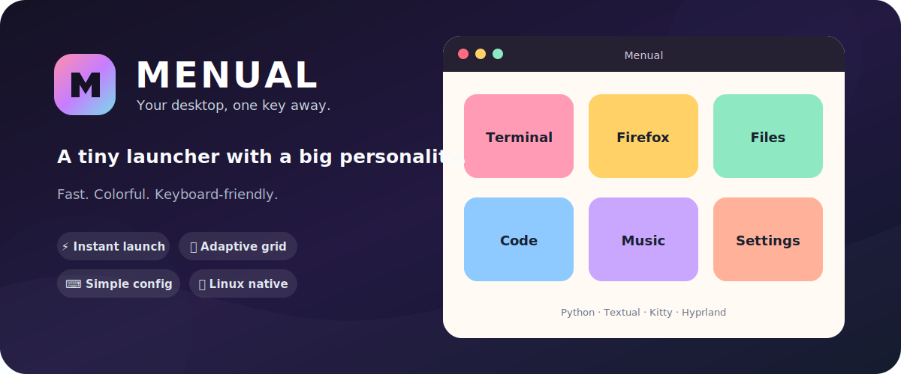

<p align="center">
  
</p>

<h1 align="center">Menual</h1>

<p align="center">
  A fast, colorful desktop application launcher built with Python, Textual and Kitty.
</p>

<p align="center">
  
  
  
  
  
</p>

## What is Menual?

Menual turns a tiny configuration file into a clean application grid. Open it, choose an entry, and get out of the way — no search index, daemon or heavyweight desktop integration required.

It is designed for Linux users who want a minimal launcher that still has some personality.

## Highlights

- **Instant launcher** powered by Textual
- **Colorful adaptive grid** that grows with your shortcuts
- **GUI and terminal commands** from the same menu
- **Kitty-native window** with automatic sizing
- **Hyprland integration** for a centered floating launcher
- **Focus-friendly behavior**: press `Escape` or click away to close
- **Plain-text configuration** with zero ceremony

## Requirements

- Linux
- Python **3.14+**
- [Kitty](https://sw.kovidgoyal.net/kitty/)
- Textual **8.2.8+**
- Hyprland and `hyprctl` are optional

## Installation

### From source

```bash
git clone https://github.com/FrancoisBasset/menual.git
cd menual

python -m venv .venv
source .venv/bin/activate
python -m pip install --upgrade pip
python -m pip install -e .
```

### Arch Linux package

A `PKGBUILD` is included:

```bash
makepkg -si
```

## Configuration

Menual reads its shortcuts from:

```text
~/.menual.conf
```

Each line contains three comma-separated values:

```text
label,command,is_gui
```

| Field | Description |
| --- | --- |
| `label` | Text displayed on the button |
| `command` | Command launched when the button is pressed |
| `is_gui` | `1` for a graphical application, `0` for a terminal command |

Example configuration:

```text
Firefox,firefox,1
Files,thunar,1
Code,code,1
System monitor,btop,0
Shell,bash,0
```

GUI applications are launched directly in their own session. Terminal commands open in a detached Kitty window.

## Usage

```bash
menual
```

Menual opens inside a dedicated Kitty window. On Hyprland, it automatically requests a floating, centered window sized to match the number of configured shortcuts.

A nice setup is to bind `menual` to a global keyboard shortcut in your desktop environment or window manager.

## Development

Install the project with its development tools:

```bash
python -m pip install -e .
python -m pip install ruff basedpyright
```

Run the checks:

```bash
ruff check .
ruff format --check .
basedpyright
```

Project layout:

```text
src/menual/
├── main.py           # Kitty and process launching
├── menual.py         # Textual interface and adaptive layout
└── menual_config.py  # ~/.menual.conf parsing
```

## Philosophy

Menual deliberately stays small: a config file, a colorful grid and the shortest possible path between an idea and an application.

## License

Released under the [MIT License](LICENSE).
